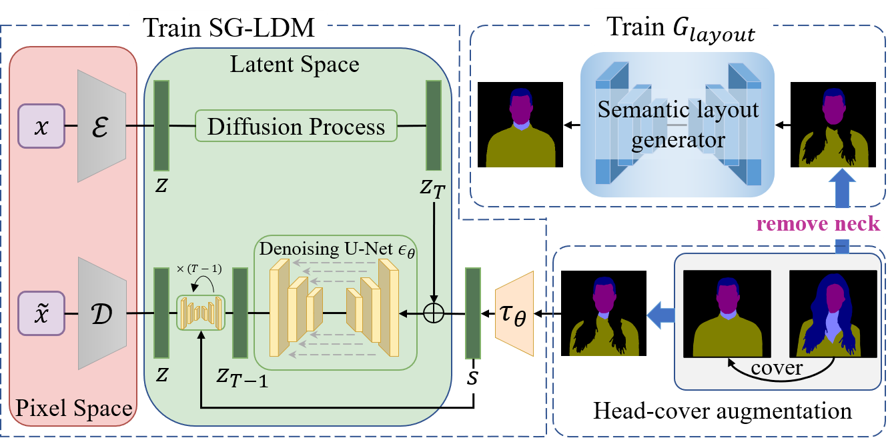
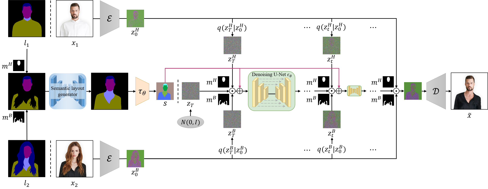

# HS-Diffusion
>**HS-Diffusion: Semantic-Mixing Diffusion for Head Swapping**
>
>Qinghe Wang, Lijie Liu, Miao Hua, Pengfei Zhu, Wangmeng Zuo, Qinghua Hu, Huchuan Lu, Bing Cao
>

This paper aims to stitch a source head to another source body, while maintaining the main components of the two source images unchanged. We first propose a semantic-mixing diffusion model for head swapping, which blends the semantic layouts to guide the mixing of diffusion latents step-by-step, stitching one head to another body seamlessly. We also propose a semantic calibration strategy to adaptively inpaint incomplete region and address the occlusion and noise issues encountered for head swapping.

## Training process.

## Inference process.

## Results

### Comparsion for head swapping:

### Semantic-guided head replacement:

### Semantic-guided local & multi-component replacement:

### Head swapping in the wild:

## Databases

**We process the [Stylish-Humans-HQ(SHHQ) dataset](https://github.com/stylegan-human/StyleGAN-Human) to the half-body SHHQ dataset as introduced in our paper. It can be downloaded from [Baidu Drive](https://pan.baidu.com/s/1TdUjplfiXayUKVpa9q_Zlw?pwd=2zjc)** with password `2zjc`.

## TODOs

- [x] Release training data
- [ ] Release training code
- [ ] Release inference code

## Contact

If you have any questions or suggestions about the paper, feel free to reach me (qinghewang@mail.dlut.edu.cn).

